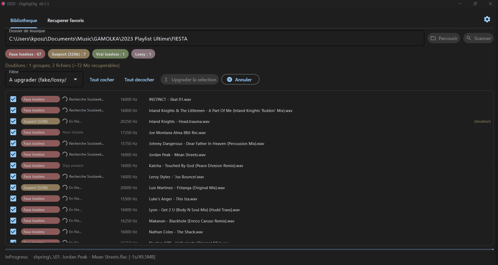
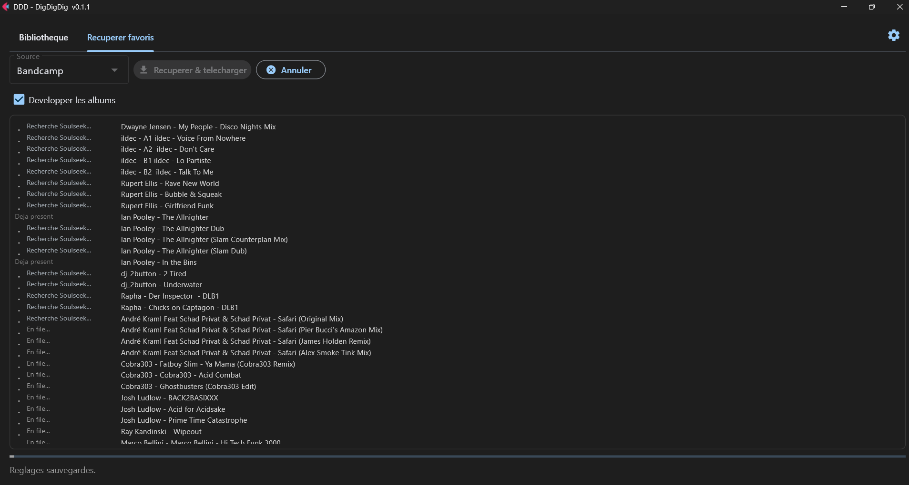

<p align="center">
  
</p>

<h1 align="center">DigDigDig</h1>

<p align="center">
  <em>The crate digger that digs three times.</em><br>
  Dig your sources -> Dig Soulseek -> Dig the file's spectrum.
</p>

<p align="center">
  <a href="https://github.com/DNSZLSK/digdigdig/releases/latest/download/DDD-windows.zip">
    
  </a>
  <br>
  <sub>Double-click, no install. <a href="https://dnszlsk.github.io/digdigdig/">Landing page</a></sub>
</p>

---

**DDD cleans up your music library and bumps it to club-playable quality, on its own.**

You point it at a folder (or your Discogs / Bandcamp favorites), and DDD:
- spots the **fake lossless**: MP3s re-encoded as .flac/.wav/.aiff that *look* lossless but aren't,
- goes and finds a **real version** on Soulseek (FLAC, WAV or AIFF, with an automatic MP3 320 fallback if nothing lossless turns up),
- checks the **spectrum** of the downloaded file to make sure it holds up (not an upscale), that it's the **right track** and not a snippet,
- files it into **a single** clean library, and sends the fakes to the trash.

No need to be a developer: download the `.exe`, double-click, it's a window.

## What it looks like

**Scan a folder and upgrade** (Lossless, HQ, Iffy or Bad? live per-track status):

<p align="center"></p>

**Pull your Discogs / Bandcamp favorites** straight to lossless:

<p align="center"></p>

## What it does

- **Quality scan**: every file is ranked by its **spectral cutoff** (the frequency where the sound stops) into one of four bands, plus duplicates:
  - **Lossless** (green): full spectrum, real lossless.
  - **HQ** (blue): >= 18 kHz, playable on a big system (includes MP3 320).
  - **Iffy** (yellow): 16-18 kHz, borderline.
  - **Bad** (red): < 16 kHz, mush.
- **Three quality presets** (minimum bar to keep, in Settings):
  - **DJ Club** (>= 18 kHz) - *default*: keeps anything club-playable, MP3 320 included.
  - **Audiophile** (>= 20 kHz): rejects MP3s below 320.
  - **Purist** (pure lossless): real full-spectrum lossless only.
- **Upgrade**: replaces your below-the-bar files with something better, found on Soulseek. DDD looks for FLAC, WAV and AIFF (lots of DJs share in WAV/AIFF), with an **automatic MP3 320 fallback** for tracks that can't be found in lossless. MP3s below 320 kbps are **banned across the board**, whatever the preset.
- **Get favorites**: scrapes your Discogs wantlist / Bandcamp wishlist and downloads it.
- **YouTube set / playlist**: paste a set URL (YouTube / 1001Tracklists) or a **YouTube playlist** (each video = a track) -> DDD extracts the tracklist into a want-list (CSV).
- **Single library**: everything that passes lands in `~/Music/DDD` (changeable in Settings), de-duplicated. Rejects go to the **trash** (recoverable), never hard-deleted.
- **Not found -> buy links**: whatever Soulseek can't find comes out as a clickable page (DDD logo + theme) with **Discogs** (vinyl marketplace, perfect for old pressings) and **Bandcamp** links to buy it.

**The safety net: the spectrum is law.** Every download is re-audited by spectrum (FFT); **the declared format and bitrate are only used for the Soulseek search, never for the keep-or-reject decision.** The spectrum doesn't lie, tags do - that's what tells a real 320 / lossless apart from an upscale (an MP3 128 re-encoded as .flac or .wav, which Soulseek's filters can't see). A file is only kept if it passes three checks: **spectral** (above the preset's bar, not an upscale), **duration** (not a snippet / preview) and **title + artist identity** (the right track, not a wrong match). Otherwise -> trash.

## Getting started (user)

> **You need a free Soulseek account** to download - create one in 30 seconds at [slsknet.org](https://www.slsknet.org/). DDD logs into Soulseek to fetch the upgrades; without it, DDD still scans and rates your files, but can't download anything. (sldl, the Soulseek client, is bundled in the `.exe` - nothing else to install.)

1. [**Download the exe**](https://github.com/DNSZLSK/digdigdig/releases/latest/download/DDD-windows.zip), unzip, double-click `DDD.exe`.
2. Open **Settings** (gear, top right) and fill in:
   - your **Soulseek** login (required to download),
   - your **Discogs token** + username, and/or your **Bandcamp** username (to pull your favorites),
   - the **library folder** (default `~/Music/DDD`).
3. **Library** tab: pick a folder -> *Scan* -> check the files -> *Upgrade selection*.
   **Get favorites** tab: pick Discogs/Bandcamp -> *Fetch & download*.

> The 3 D's: **DIG** your sources -> **DOWNLOAD** from Soulseek -> **DETECT** by spectrum. The output
> is your verified lossless library, which you can then share / point anywhere you want.

## Usage & responsibility

DDD is a tool to manage **your** library (quality analysis, organization, fetching via Soulseek).
It **hosts, distributes and provides no content**: it's a client that automates the search, like a
browser or a torrent client.

Soulseek is a peer-to-peer network. Downloading copyrighted music without authorization from the
rights holders may be **illegal** in your country. **You are solely responsible for your use** and
for complying with copyright law. Use DDD for what you have the right to: your own music, your
productions, your promos / white-labels, public domain / CC, or re-downloading in lossless what you
**already own**.

## Stack

Portable **Python** core (Windows / Mac / Linux) + native **Flet** window. Downloading via
**sldl** ([fiso64/slsk-batchdl](https://github.com/fiso64/slsk-batchdl), bundled). Spectral detection
via numpy/scipy/soundfile. Scrapers for Discogs (API), Bandcamp (cloudscraper), YouTube sets and
playlists (yt-dlp). Everything is bundled into the `.exe` (no Python, no ffmpeg needed).

---

<details>
<summary><b>For developers</b> (CLI, exe build, legacy PowerShell pipeline)</summary>

### CLI

```powershell
# install the core + the GUI
.\.venv\Scripts\python.exe -m pip install -e ".[gui]"

# Scan a folder: Lossless / HQ / Iffy / Bad? well named? duplicates?
.\.venv\Scripts\python.exe -m ddd scan "C:\path\to\Music"

# Upgrade: drops real lossless into the library, fake source -> trash
.\.venv\Scripts\python.exe -m ddd upgrade "C:\path\to\Music"

# Import an existing folder into the library (lossless kept, the rest trashed)
.\.venv\Scripts\python.exe -m ddd import "C:\path\to\Music"

# Rename a folder back to "Artist - Title" (from name + tags; dry-run, --apply to write)
.\.venv\Scripts\python.exe -m ddd rename "C:\path\to\Music"

# Pull your favorites -> library
.\.venv\Scripts\python.exe -m ddd scrape bandcamp <user>
.\.venv\Scripts\python.exe -m ddd acquire outputs\bandcamp_<user>.csv

# DJ set or YouTube playlist (each video = a track) -> extract the tracklist to a want-list CSV
.\.venv\Scripts\python.exe -m ddd scrape djset "https://www.youtube.com/playlist?list=..."

# Not found -> Discogs + Bandcamp buy-links page (folder, upgrade report, or want-list)
.\.venv\Scripts\python.exe -m ddd buy "C:\path\to\Music"

# Settings (library folder, Discogs token, Soulseek login) -> %APPDATA%\ddd
.\.venv\Scripts\python.exe -m ddd config set download_dir "D:\My Library"
.\.venv\Scripts\python.exe -m ddd config set discogs_token <token>

# The native window
.\.venv\Scripts\python.exe -m ddd gui
```

Query resolution: name `Artist - Title` -> else ID3/Vorbis tags -> else title-only.
Compilations (`Various Artists`), vinyl side prefixes (`A1`, `B2`...) and artists duplicated
in the title are normalized before the search.

### Building the `.exe`

```powershell
.\.venv\Scripts\python.exe -m pip install -e ".[gui,build]"
.\packaging\build.ps1
```

Output: `dist\DDD\DDD.exe`. sldl, the profiles, the GUI client and the audio decoding
(libsndfile) are bundled. Details + Mac/Linux build: `packaging/README.md`.

### Legacy PowerShell pipeline (still available)

The project started as a PowerShell pipeline (`pipeline.ps1` + `lib/`), which still works:

```powershell
$env:DISCOGS_TOKEN = "your_token"
.\.venv\Scripts\python.exe lib\scrapers\discogs.py <user> -o inputs\sldl_input.csv
.\pipeline.ps1 -SkipConvert -AutoClean       # DOWNLOAD + audit + DETECT
.\pipeline.ps1 -SkipConvert -SkipDownload -SkipVerify -DoDeploy -UsbRoot "D:\My Library"
```

</details>
