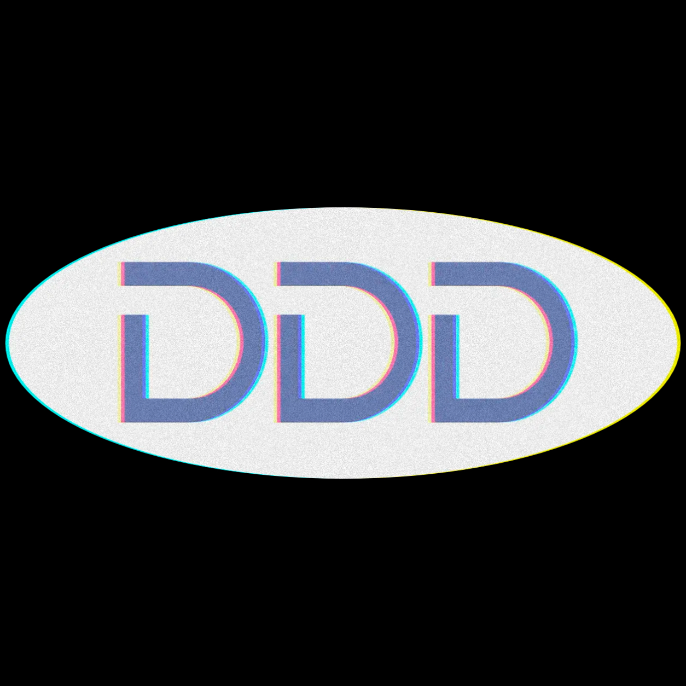

<p align="center">
  
</p>

<h1 align="center">DigDigDig</h1>

<p align="center">
  <a href="https://github.com/DNSZLSK/digdigdig/releases/latest/download/DDD-windows.zip">
    
  </a>
  <br>
  <sub><a href="https://dnszlsk.github.io/digdigdig/">Page de présentation</a> · double-clic, aucune install</sub>
</p>

<p align="center">
  <em>Le crate digger qui creuse trois fois.</em><br>
  Dig tes sources → Dig Soulseek → Dig le spectre du fichier.
</p>

---

**Pourquoi DDD ?** Parce que je suis feignant, et que j'aime le bon son. Combinaison redoutable.

Maintenir une bibliothèque DJ en **vrai lossless** à la main, c'est des heures perdues :
vérifier la source de chaque track, retracker les fichiers foireux, jongler entre les
plateformes, refaire la même recherche pour la 4e fois parce qu'on a oublié qu'on l'avait
déjà. DDD fait tout ça à ma place : il part de mes favoris (Discogs, Bandcamp, …), va digger
sur Soulseek en **matchant le titre complet** (pas d'à-peu-près), passe chaque fichier au
**scanner spectral anti-fake-FLAC**, et me laisse juste digger et écouter.

> La sortie (le « DEPLOY ») est **configurable** : dossier local, NAS, library
> Rekordbox/Serato… c'est juste une copie vers la cible de ton choix, pas le cœur du projet.

## Les 3 D

```
┌──── DIG ────┐     ┌── DOWNLOAD ──┐     ┌──── DETECT ────┐     ┌── deploy ──┐
│ scrapers    │ ──▶ │ sldl + retry │ ──▶ │ flac-detective │ ──▶ │ copie vers │
│ (Discogs,   │     │ (Soulseek)   │     │ + audit titre- │     │ une cible  │
│  Bandcamp)  │     │ match strict │     │ complet + clean│     │ configurable│
└─────────────┘     └──────────────┘     └────────────────┘     └────────────┘
   favoris /          vrai lossless,        spectre FFT +           dossier local,
   wishlists          titre exact           anti-mismatch           NAS, Rekordbox…
```

1. **DIG** - scrape tes favoris (`lib/scrapers/discogs.py`, `bandcamp.py`) → un CSV de tracks.
2. **DOWNLOAD** - `sldl` télécharge en lossless depuis Soulseek (profil strict), avec retry sur les misses.
3. **DETECT** - double contrôle :
   - **audit titre-complet** : le fichier doit matcher *exactement* ce qui a été demandé -
     rappel + **précision** (pas de mots en trop) + **version** (`Original` ≠ `(X Remix)` ≠
     `Extended`, selon ta demande) + durée ±10 % + tags. Les mauvais → quarantaine.
   - **flac-detective** : analyse spectrale FFT pour démasquer les faux FLAC (MP3 transcodés).
4. **deploy** *(opt-in)* - copie **uniquement** les fichiers validés vers la cible de ton choix.

## Stack

- **PowerShell** - pipeline orchestrateur + lib utilitaire (natif Windows)
- **Python 3.12** (venv local `.venv/`) - scrapers + FLAC_Detective
- **sldl** (`bin/sldl/`) - binary .NET self-contained, batch Soulseek ([fiso64/slsk-batchdl](https://github.com/fiso64/slsk-batchdl))
- **ffmpeg / ffprobe** - décodage + durée/tags pour l'audit (`winget install Gyan.FFmpeg`)
- **cloudscraper** - bypass FingerprintJS sur Bandcamp
- **slskd** *(optionnel)* - daemon Soulseek headless, dashboard sur le port 5030

## Layout

```
ddd/
├── pipeline.ps1                # entrypoint
├── lib/
│   ├── convert-csv.ps1         # CSV (FR) -> CSV sldl
│   ├── audit-staging.ps1       # match titre COMPLET (rappel + précision + version)
│   ├── clean-staging.ps1       # quarantaine SUSPECT -> _rejected/ + rename
│   ├── retry-fakes.ps1         # query variants pour les misses
│   ├── route-files.ps1         # deploy (Status=OK only) vers la cible
│   └── scrapers/
│       ├── discogs.py          # wantlist + collection (API officielle)
│       └── bandcamp.py         # wishlist (cloudscraper + fancollection API)
├── config/sldl.conf            # profils lossless / lossless-strict / mp3-fallback
├── bin/sldl/                   # sldl.exe
├── docs/logo.png               # le triple D
├── inputs/  outputs/  staging/  logs/   # données run-time (gitignored)
└── .venv/                      # venv Python (gitignored)
```

## Usage

```powershell
# 0. Une fois : deps
#    - sldl dans bin/sldl/ ; winget install Gyan.FFmpeg
#    - python -m venv .venv ; .venv\Scripts\pip install requests beautifulsoup4 cloudscraper flac-detective

# 1. DIG : scrape une source -> inputs\sldl_input.csv
$env:DISCOGS_TOKEN = "ton_token"
.\.venv\Scripts\python.exe lib\scrapers\discogs.py <user> -o inputs\sldl_input.csv
#   ou
.\.venv\Scripts\python.exe lib\scrapers\bandcamp.py <user> -o inputs\sldl_input.csv

# 2. DOWNLOAD + DETECT (audit + clean) en un appel
.\pipeline.ps1 -SkipConvert -AutoClean

# 3. DEPLOY (opt-in) vers la cible de ton choix (n'importe quel dossier)
.\pipeline.ps1 -SkipConvert -SkipDownload -SkipVerify -DoDeploy -UsbRoot "D:\Ma Library"
```

**Switches utiles** : `-Limit N` (smoke test), `-OnlyTier N`, `-DoRetry` (retry des misses),
`-AutoClean` (audit + clean auto), `-DeleteOld` (avec `-DoDeploy`, supprime les vieux fichiers remplacés).

## L'app `ddd` (coeur Python portable + fenêtre native)

Le pipeline PowerShell ci-dessus reste dispo, mais le projet est désormais aussi un
**vrai logiciel** : un coeur Python portable (Windows / Mac / Linux) avec une fenêtre
native, qui scanne **n'importe quel dossier existant** (pas besoin d'être passé par le
pipeline) et sait upgrader les fichiers tout seul.

Tout ce que DDD valide finit dans **une seule bibliothèque** `downloads/` (par défaut
`~/Music/DDD`, modifiable dans les Réglages) - alimentée aussi bien par l'upgrade que par
la récupération de favoris, dédoublonnée à l'entrée. Ce qui est rejeté part à la **corbeille**
(récupérable), jamais supprimé en dur.

```powershell
# Scanner un dossier : vrai lossless ou faux ? bien nommé ? doublons ?
.\.venv\Scripts\python.exe -m ddd scan "C:\chemin\vers\Musique"

# Upgrader : pour chaque faux/lossy, va chercher un vrai lossless sur Soulseek,
#   le DÉPOSE dans la bibliothèque et envoie le faux source à la corbeille
.\.venv\Scripts\python.exe -m ddd upgrade "C:\chemin\vers\Musique"

# Importer un dossier existant dans la bibliothèque
#   (vrais lossless gardés + dédoublonnés, le reste à la corbeille)
.\.venv\Scripts\python.exe -m ddd import "C:\chemin\vers\Musique"

# Scraper tes favoris -> want-list, puis télécharger en vrai lossless dans la bibliothèque
.\.venv\Scripts\python.exe -m ddd scrape bandcamp <user>
.\.venv\Scripts\python.exe -m ddd acquire outputs\bandcamp_<user>.csv

# Réglages (dossier bibliothèque, token Discogs, login Soulseek) persistés dans %APPDATA%\ddd
.\.venv\Scripts\python.exe -m ddd config set download_dir "D:\Ma Bibliotheque"
.\.venv\Scripts\python.exe -m ddd config set discogs_token <token>

# La fenêtre native (installer flet : pip install -e ".[gui]")
.\.venv\Scripts\python.exe -m ddd gui
```

**Le filet de sécurité clé** : un fichier téléchargé n'est gardé que s'il passe trois
contrôles - **spectral** (vrai lossless, pas un upscale MP3→FLAC, que les filtres Soulseek
ne voient pas), **durée** (pas un extrait/preview), et **identité titre+artiste** (le bon
morceau, pas un faux match fuzzy). Sinon → corbeille.

### Le `.exe` pour tout le monde

```powershell
.\.venv\Scripts\python.exe -m pip install -e ".[gui,build]"
.\packaging\build.ps1
```

Sortie : `dist\DDD\DDD.exe`. Double-clic = la fenêtre s'ouvre, **sans installer Python**.
sldl, les profils, le client graphique et le décodage audio (libsndfile) sont embarqués -
**pas besoin de ffmpeg**. Détails et build Mac/Linux : `packaging/README.md`.
