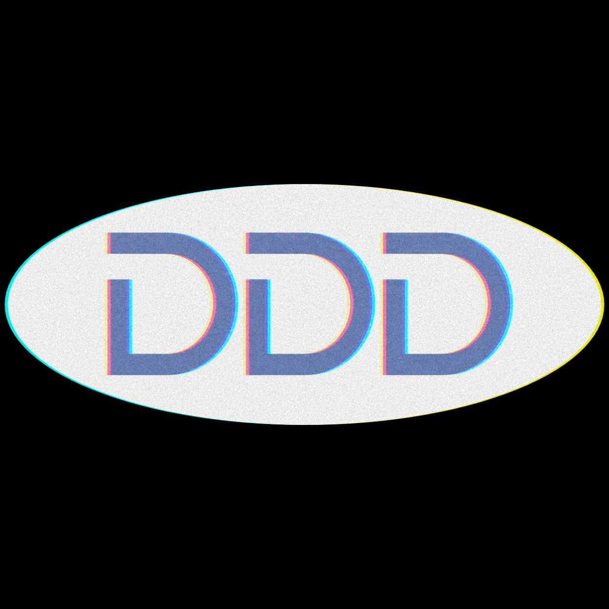
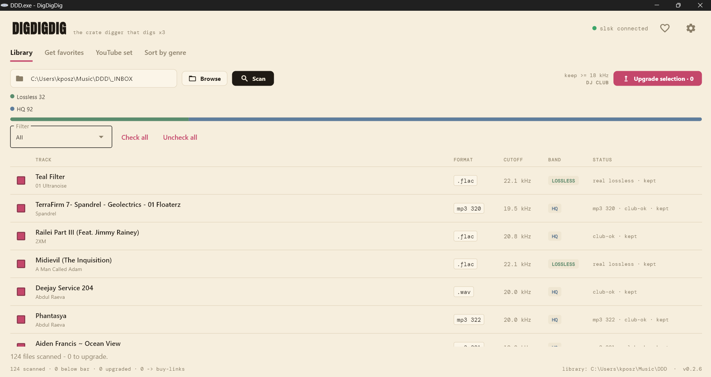
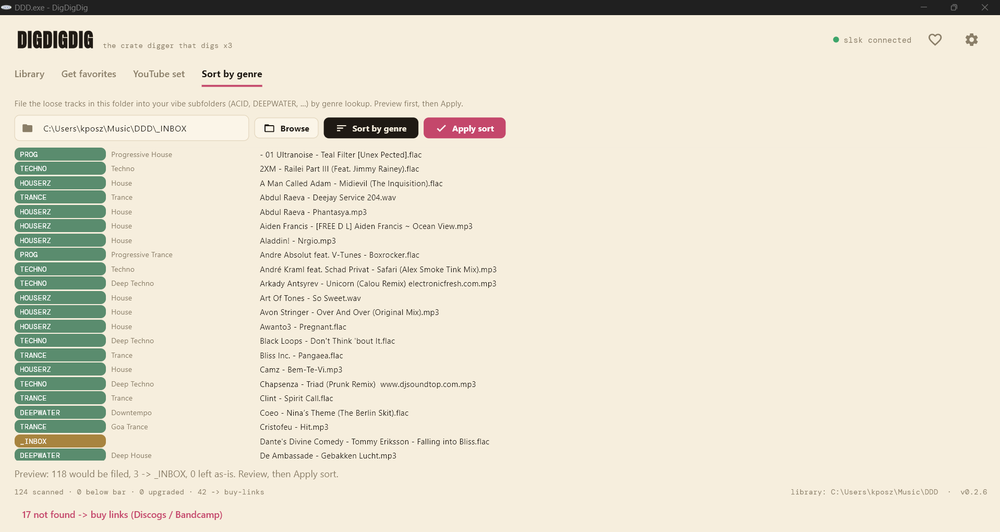
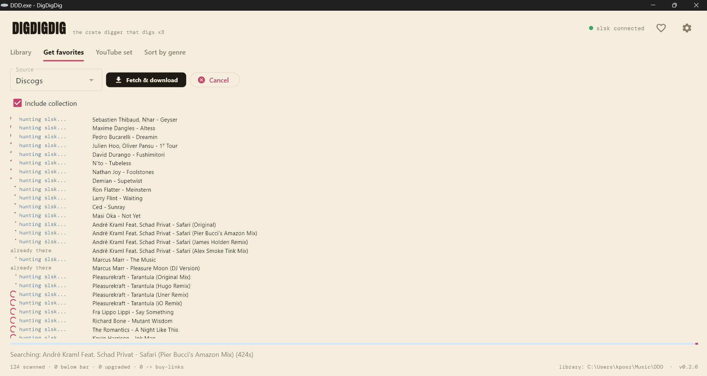
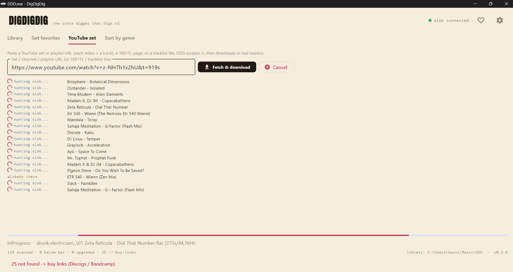

<p align="center">
  
</p>

<h1 align="center">DigDigDig</h1>

<p align="center">
  <em>The crate digger that digs three times.</em><br>
  Dig your sources -> Dig Soulseek -> Dig the file's spectrum.
</p>

<p align="center">
  <a href="https://github.com/DNSZLSK/digdigdig/releases/latest/download/DDD-windows.zip">
    
  </a>
  <a href="https://github.com/DNSZLSK/digdigdig/releases/latest/download/DDD-macos-AppleSilicon.zip">
    
  </a>
  <br>
  <a href="https://github.com/DNSZLSK/digdigdig/releases">
    
  </a>
  <br>
  <sub>Double-click, no install. <a href="https://dnszlsk.github.io/digdigdig/">Landing page</a></sub>
</p>

---

**DDD cleans up your music library and bumps it to club-playable quality, on its own.**

You point it at a folder (or your Discogs / Bandcamp favorites), and DDD:
- flags **limited bandwidth and suspicious encodings** for review,
- searches for a **candidate version** on Soulseek (FLAC, WAV or AIFF, with an automatic MP3 320 fallback if nothing lossless turns up),
- checks the downloaded file against your **bandwidth threshold**, requested identity and duration,
- adds accepted candidates to your library and **retains originals by default**.

No need to be a developer: download the `.exe`, double-click, it's a window.

## What it looks like

**Library - scan a folder and upgrade** (Lossless, HQ, Iffy or Bad? live per-track status):

<p align="center"></p>

**Sort by genre - filed from the spectrum** (local audio-ML; even untagged / badly named tracks):

<p align="center"></p>

**Get favorites - Discogs / Bandcamp** straight to lossless:

<p align="center"></p>

**YouTube set - paste a set / playlist URL**, DDD scrapes the tracklist:

<p align="center"></p>

## What it does

- **Quality scan**: every file is ranked by its **spectral cutoff** (the frequency where the sound stops) into one of four bands, plus duplicates:
  - **Wide** (green): wide spectrum observed; compression history remains unknown. The CSV identifier `LOSSLESS` is retained for compatibility.
  - **HQ** (blue): >= 18 kHz, playable on a big system (includes MP3 320).
  - **Iffy** (yellow): 16-18 kHz, borderline.
  - **Review** (red): reduced bandwidth or bitrate below the configured floor.
- **Reads pretty much anything**: FLAC, WAV, AIFF, MP3, OGG/Opus, **MP4 / M4A** (AAC *and* ALAC), **WMA** (including WMA Lossless), APE, TTA, WavPack. That old folder of iTunes-era `.mp4` rips or Windows Media `.wma` gets scanned like the rest, instead of showing up empty. What's *inside* the container decides: an ALAC `.m4a` is treated as lossless and put through the same anti-upscale spectral check as a FLAC, not written off as lossy because of its extension.
- **Quality / target modes** (in Settings) - the bar DDD keeps to, and what it goes hunting for:
  - **DJ Club** (>= 18 kHz) - *default*: keeps anything club-playable, MP3 320 included.
  - **Audiophile** (>= 20 kHz): rejects MP3s below 320.
  - **Purist** (wide spectrum): only candidates classified as wide spectrum; if it's not on Soulseek -> buy links, no MP3 fallback.
  - **MP3 320** (vintage / mobile): hunts MP3 320 straight, skips FLAC - for old gear that won't read FLAC, or syncing over mobile data. Bumps your sub-320s up to 320; leaves the lossless you already have untouched.
  - **WAV/AIFF only** / **FLAC only**: target a single lossless container (old CDJs/samplers that won't read FLAC, or a FLAC-homogeneous library). DDD never transcodes what you already own - the mode just picks the format of what it fetches.
- **Upgrade**: downloads candidates from Soulseek and retains the originals by default. The CLI `--trash-original` option or GUI checkbox explicitly enables removal, only after a verified copy has been installed. Name collisions retain both names using a numbered suffix. In **DJ Club / Audiophile** it looks for FLAC, WAV and AIFF (lots of DJs share in WAV/AIFF), with an **automatic MP3 320 fallback** for tracks that can't be found in lossless. MP3s below 320 kbps are **banned across the board**, whatever the mode.
- **Get favorites**: scrapes your Discogs wantlist / Bandcamp wishlist and downloads it.
- **YouTube set / playlist**: paste a set URL (YouTube / 1001Tracklists) or a **YouTube playlist** (each video = a track) -> DDD extracts the tracklist into a want-list (CSV).
- **Single library**: everything that passes lands in `~/Music/DDD` (changeable in Settings), de-duplicated. Rejected download candidates go to the **trash**. Import leaves rejected, unreadable and duplicate source files in place.
- **Sort by genre** (*Sort by genre* button / `ddd sort`): files your loose tracks into your own **vibe folders** through a cascade - the file's **ID3 genre tag**, then **Discogs** (+ MusicBrainz), and when both come up empty a **local audio model** (Discogs-EffNet, 400 Discogs styles) that reads the genre **from the spectrum** - so even an untagged, badly-named edit (`Track_01.flac`) lands in the right folder instead of `_INBOX`. The default set is house/techno-oriented (ACID, DEEPWATER, HOUSERZ, PROG, TECHNO, TRANCE, GARAGE, DISCO-FUNK, BREAKS-ELECTRO) and is **fully editable** in Settings. **Dry-run by default** - you preview, then Apply. Only loose files are touched, never your curated subfolders. (The audio model runs **on-device, no cloud**; by the MTG/UPF, CC BY-NC.)
- **Identify - recover lost names** (*Identify* tab / `ddd identify`): files called `YH1`, `track01`, `unknown 04`? DDD reads each file's **acoustic fingerprint** (Chromaprint) and matches it against **AcoustID** (the open, MusicBrainz-backed database, same idea as Shazam) to recover *Artist - Title*. It **proposes**, you **confirm track by track** (confident matches pre-ticked, uncertain ones flagged), then it renames + tags only what you kept - **never a blind rename**. Underground / unreleased tracks that aren't in the database just stay untouched.
- **Not found -> buy links**: whatever Soulseek can't find comes out as a clickable page (DDD logo + theme) with **Discogs** (vinyl marketplace, perfect for old pressings) and **Bandcamp** links to buy it.

**Safety and limits.** Spectral analysis measures bandwidth; it cannot prove the history of a recording. A genuine filtered recording can fall below your chosen threshold. Review by listening before removing originals. Downloads must match the complete normalized title, a complete named collaborator, the requested version and measured duration (10% tolerance, minimum 2 seconds). Without a reference duration, candidates under 90 seconds are rejected; unknown duration or artist is not accepted. Matching is conservative and can reject valid naming variations.

Accepted downloads are copied without overwriting existing files, flushed and checked by SHA-256 before staging is removed. Original removal is opt-in and happens afterwards. Import never trashes source files; importing a library into itself is a no-op. Scan and rename only label content-identical files as duplicates; import retains such copies for review.

## Getting started (user)

> **You need a free Soulseek account** to download - and there's **no website signup**: you just pick a username + password in DDD's **Settings** and your first login creates the account (or set them in a client like SoulseekQt and reuse them). Heads-up: the `slsknet.org` **site** login is only the **forum**, a separate system that won't work on the network - don't register there expecting it to log DDD in. Without an account DDD still scans and rates your files, but can't download. (sldl, the Soulseek client, is bundled in the `.exe` - nothing else to install.) **Can't connect / login fails?** -> [TROUBLESHOOTING.md](TROUBLESHOOTING.md).

1. **Download** [Windows `.exe`](https://github.com/DNSZLSK/digdigdig/releases/latest/download/DDD-windows.zip) or [macOS `.app`](https://github.com/DNSZLSK/digdigdig/releases/latest/download/DDD-macos-AppleSilicon.zip) (Apple Silicon), unzip, double-click. On macOS, first launch: **right-click -> Open** (the app is unsigned).
2. Open **Settings** (gear, top right) and fill in:
   - your **Soulseek** login (required to download),
   - your **Discogs token** + username, and/or your **Bandcamp** username (to pull your favorites),
   - the **library folder** (default `~/Music/DDD`).
3. **Library** tab: pick a folder -> *Scan* -> check the files -> *Upgrade selection*.
   **Get favorites** tab: pick Discogs/Bandcamp -> *Fetch & download*.

> The 3 D's: **DIG** your sources -> **DOWNLOAD** from Soulseek -> **DETECT** by spectrum. The output
> is a library of candidates checked against your selected thresholds, which you can then share / point anywhere you want.

## Usage & responsibility

DDD is a tool to manage **your** library (quality analysis, organization, fetching via Soulseek).
It **hosts, distributes and provides no content**: it's a client that automates the search, like a
browser or a torrent client.

Soulseek is a peer-to-peer network. Downloading copyrighted music without authorization from the
rights holders may be **illegal** in your country. **You are solely responsible for your use** and
for complying with copyright law. Use DDD for what you have the right to: your own music, your
productions, your promos / white-labels, public domain / CC, or re-downloading in lossless what you
**already own**.

## Stack

Portable **Python** core (Windows / Mac / Linux) + native **Flet** window. Downloading via
**sldl** ([fiso64/slsk-batchdl](https://github.com/fiso64/slsk-batchdl), bundled). Spectral detection
via numpy/scipy/soundfile, with **PyAV** as the decoding fallback for what libsndfile won't open
(MP4/M4A, WMA, APE...); genre-from-audio via a **Discogs-EffNet** ONNX model run with **onnxruntime** (no TensorFlow). Scrapers for Discogs (API), Bandcamp (cloudscraper), YouTube sets and
playlists (yt-dlp). Everything is bundled into the `.exe` (no Python, no ffmpeg to install).

---

<details>
<summary><b>For developers</b> (CLI, exe build, legacy PowerShell pipeline)</summary>

### CLI

```powershell
# install the core + the GUI
.\.venv\Scripts\python.exe -m pip install -e ".[gui]"

# Scan a folder: Lossless / HQ / Iffy / Bad? well named? duplicates?
.\.venv\Scripts\python.exe -m ddd scan "C:\path\to\Music"

# Upgrade: add accepted copies; retain originals (use --trash-original to opt into removal)
.\.venv\Scripts\python.exe -m ddd upgrade "C:\path\to\Music"

# Import accepted files; leave rejects, errors and confirmed duplicates at source
.\.venv\Scripts\python.exe -m ddd import "C:\path\to\Music"

# Rename a folder back to "Artist - Title" (from name + tags; dry-run, --apply to write)
.\.venv\Scripts\python.exe -m ddd rename "C:\path\to\Music"

# Identify no-name files by acoustic fingerprint (AcoustID); review, then --apply renames + tags
.\.venv\Scripts\python.exe -m ddd identify "C:\path\to\Music"

# Sort loose tracks into vibe folders by genre (Discogs/MusicBrainz; dry-run, --apply to move)
.\.venv\Scripts\python.exe -m ddd sort "C:\path\to\Music" --library "C:\path\to\Music"

# Pull your favorites -> library
.\.venv\Scripts\python.exe -m ddd scrape bandcamp <user>
.\.venv\Scripts\python.exe -m ddd acquire outputs\bandcamp_<user>.csv

# DJ set or YouTube playlist (each video = a track) -> extract the tracklist to a want-list CSV
.\.venv\Scripts\python.exe -m ddd scrape djset "https://www.youtube.com/playlist?list=..."

# Not found -> Discogs + Bandcamp buy-links page (folder, upgrade report, or want-list)
.\.venv\Scripts\python.exe -m ddd buy "C:\path\to\Music"

# Settings (library folder, Discogs token, Soulseek login) -> %APPDATA%\ddd
.\.venv\Scripts\python.exe -m ddd config set download_dir "D:\My Library"
.\.venv\Scripts\python.exe -m ddd config set discogs_token <token>

# The native window
.\.venv\Scripts\python.exe -m ddd gui
```

Query resolution: name `Artist - Title` -> else ID3/Vorbis tags -> else title-only.
Compilations (`Various Artists`), vinyl side prefixes (`A1`, `B2`...) and artists duplicated
in the title are normalized before the search.

### Verification

```sh
python -m pip install -e ".[gui,test]"
python -m pytest -q
```

The suite includes the standalone legacy scenarios in isolated subprocesses. CI runs core,
CLI and GUI construction tests on Windows, Linux and macOS for pull requests. The macOS
release build depends on this suite; the Windows build script also runs it before packaging.

### Building the `.exe`

```powershell
.\.venv\Scripts\python.exe -m pip install -e ".[gui,build,test]"
.\packaging\build.ps1
```

Output: `dist\DDD\DDD.exe`. sldl, the profiles, the GUI client and the audio decoding
(libsndfile) are bundled. Details + Mac/Linux build: `packaging/README.md`.

### Docker (NAS / headless Linux)

The whole pipeline as a CLI image (no GUI): scan, upgrade, acquire, scrape, rename, sort, buy.
sldl is bundled, so Soulseek downloads work too - creds via environment variables.

```sh
docker build -t ddd .

# scan a mounted library (spectral audit)
docker run --rm -v /mnt/music:/music ddd scan /music -o /music/ddd-scan.csv

# upgrade via Soulseek (creds by env, output into the mounted library)
docker run --rm \
  -e DDD_SOULSEEK_USER=you -e DDD_SOULSEEK_PASS=secret \
  -v /mnt/music:/music \
  ddd upgrade /music --download-dir /music
```

x86_64 only. Details: `docker/README.md`.

### Legacy PowerShell pipeline (still available)

The project started as a PowerShell pipeline (`pipeline.ps1` + `lib/`), which still works:

```powershell
$env:DISCOGS_TOKEN = "your_token"
.\.venv\Scripts\python.exe lib\scrapers\discogs.py <user> -o inputs\sldl_input.csv
.\pipeline.ps1 -SkipConvert -AutoClean       # DOWNLOAD + audit + DETECT
.\pipeline.ps1 -SkipConvert -SkipDownload -SkipVerify -DoDeploy -UsbRoot "D:\My Library"
```

</details>
